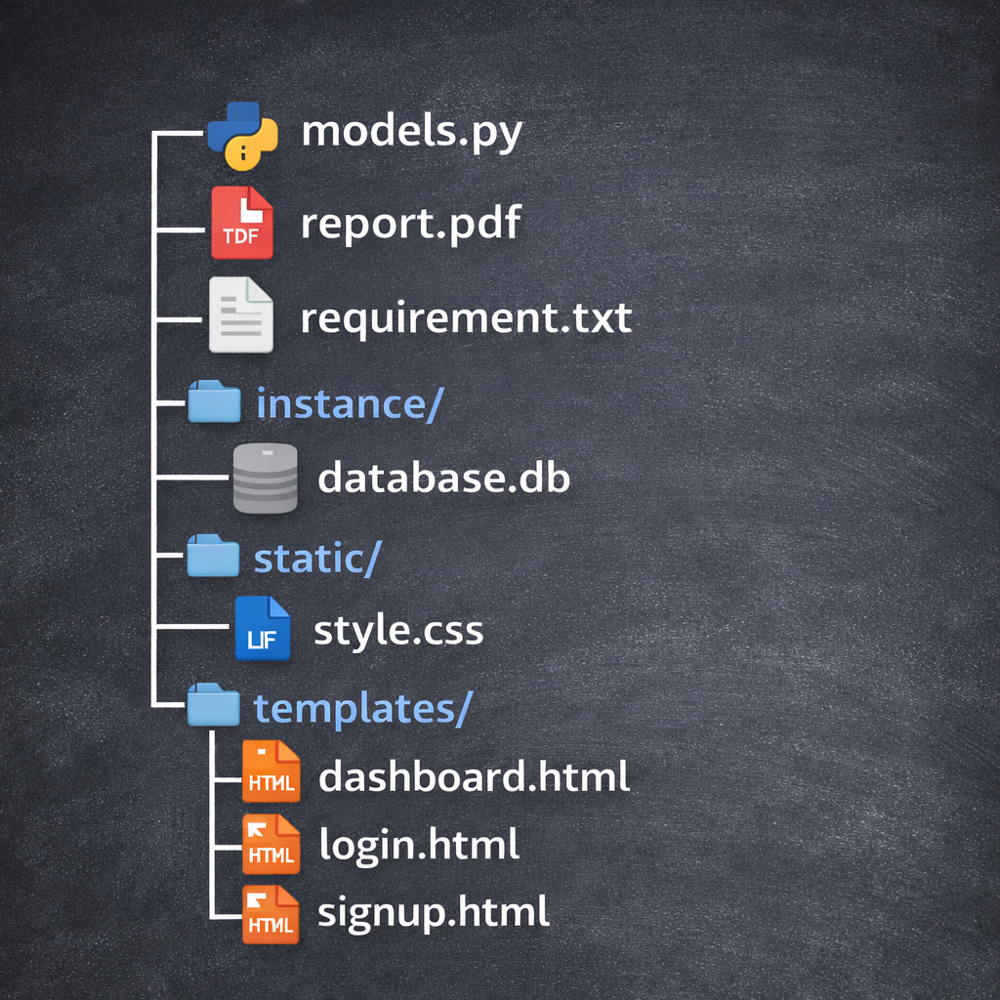

# 🔗 URL Shortener Web Application (Advanced Users)

A full-stack URL Shortener web application built using **Flask**, allowing users to shorten long URLs, securely log in, and manage their shortened links with user-specific history.

This project was developed individually as part of hands-on learning and internship-level practice.

---

## 📌 Features

- 🔐 User Signup & Login authentication  
- 📏 Username validation (5–9 characters)  
- 🔗 URL shortening and redirection  
- 💾 User-specific URL history  
- 🎨 Clean and responsive UI  
- ⚙️ Flask 3.x compatible database handling  

---

## 🛠️ Tech Stack

| Layer        | Technology |
|-------------|------------|
| Frontend    | HTML, CSS, Bootstrap |
| Backend     | Flask (Python) |
| Authentication | Flask-Login |
| ORM         | SQLAlchemy |
| Database    | SQLite |

---

## 📂 Project Structure




---

## 🚀 How the Application Works

1. User signs up with a unique username (5–9 characters).
2. User logs in using credentials.
3. After login, the dashboard is displayed.
4. User enters a long URL to shorten.
5. The application generates a unique short URL.
6. The shortened URL is stored in the database.
7. Users can view and reuse their previous URLs.
8. Accessing the short URL redirects to the original link.

---

## ▶️ How to Run the Project

### 1️⃣ Clone the Repository
```bash
git clone https://github.com/your-username/url-shortener-flask.git
cd url-shortener-flask
```

### 2️⃣ Install Dependencies

```bash
pip install -r requirements.txt
```


### 3️⃣ Run the Application

```bash
python app.py
```

### 4️⃣ Open in Browser

```bash
http://127.0.0.1:5000/
```

### 🗄️ Database Details

- Database: SQLite

- Auto-created at:

```bash
instance/database.db
```

### Tables

- User – stores user credentials

- URL – stores original and shortened URLs linked to users


## ⚠️ Important Notes

- Compatible with **Flask 3.x**
- Database tables are created using `app.app_context()`
- Each user can access only their own URLs
- SQLAlchemy ORM is used (no raw SQL)

---

## 🧠 Learning Outcomes

- Flask backend development
- Authentication using Flask-Login
- ORM-based database design
- Frontend–backend integration
- Debugging real-world Flask issues
- Structuring scalable web applications


## 🙏 Acknowledgment

This project was developed with guidance from **Innomatics Research Labs**.

---

## 👤 Author

**Kesavapavan Gadde**


